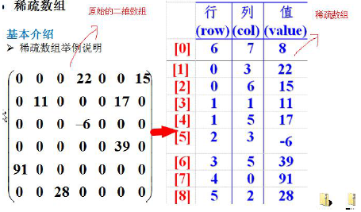
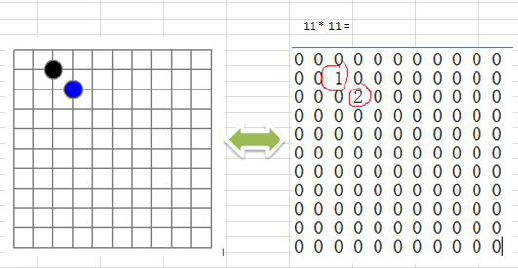

最近在B站看关于尚硅谷韩师傅的数据结构与算法，个人感觉讲的很好，顺便来做下笔记

##### 线性结构和非线性结构：

线性：

数据元素之间一对一

顺序存储结构（存储元素的地址是连续的） 链式存储结构（不一定连续）

常见：数组、队列，链表和栈

非线性：二维数组、树、图

##### 稀疏数组：

我们常见的比如二维数组，当其中有效的数据占用的比较少时，就可以使用稀疏数组对原二维数组进行压缩，以达到节省空间的目的。

稀疏数组主要由3列组成，其中第一行尤比较特殊。

第一行的第一列，表示原二维数组的行数；第二列表示原二维数组的列数；第三列表示原二维数组有效数据的个数。

从第二行开始，就表示原二维数组中的有效数据在数组中所在的行、列和具体值。



例如：要把二维数组转换为稀疏数组，再从稀疏数组转换为二维数组




java代码：

```java
/**
 * 假设有一个二位棋谱，其中黑子代表1，白子代表2,其他为0
 * 二位数组转稀疏数组
 * 首先，稀疏数组只有三列组成，第一行三列分别为总行数，总列数，和有效数据的个数。
 * 1、要获取有效数据的个数
 * 2、创建稀疏数组
 * 3、将二位数组的数据存入到稀疏数组
 * <p>
 * 稀疏数组转二位数组
 * 1、读取稀疏数组第一行，根据读取到的数据创建二位数组
 * 2、读取后几行数据，赋值给二维数组
 */
public class SparseArray {
    public static void main(String[] args) {
        int[][] chessArr = new int[11][11];
        chessArr[1][2] = 1;
        chessArr[2][3] = 2;

//        遍历二维数组
        for (int[] row : chessArr) {
            for (int i : row) {
                System.out.printf("%d\t", i);
            }
            System.out.println();
        }
//    稀疏数组第一行数据，二维数组的行，列，有效数据的个数
//    还需要知道计算出二维数组中不为0的元素个数
        int sum = 0;
        for (int[] row : chessArr) {
            for (int i : row) {
                if (i != 0) sum++;
            }
        }
            System.out.println(sum);

//      创建稀疏数组，因为稀疏数组一共就三列,行数为有效数据的个数+1
        int[][] chessArr2 = new int[sum + 1][3];
        chessArr2[0][0] = 11;
        chessArr2[0][1] = 11;
        chessArr2[0][2] = sum;

        System.out.println("======二维数组======");
        for (int[] row : chessArr2) {
            for (int i : row) {
                System.out.printf("%d\t", i);
            }
            System.out.println();
        }

//        这里使用普通for循环
        int count = 0;
        for (int i = 0; i < chessArr.length; i++) {
            for (int j = 0; j < chessArr.length; j++) {
                if (chessArr[i][j] != 0) {
                    ++count;
                    chessArr2[count][0] = i;
                    chessArr2[count][1] = j;
                    chessArr2[count][2] = chessArr[i][j];
                }
            }
        }
        System.out.println("稀疏数组");
        for (int[] row : chessArr2) {
            for (int i : row) {
                System.out.printf("%d\t", i);
            }
            System.out.println();
        }

        /**
         * 将稀疏数组恢复成二维数组
         * chessArr2是稀疏数组
         */
        int[][] chessArr3 = new int[chessArr2[0][0]][chessArr2[0][1]];
//        遍历稀疏数组，除去第一行。

        /**
         * 这里需要着重记一下，稀疏数组第一行不是具体的二维数组内容
         * 从第二行开始，比如稀疏数组chessArr2,其中，
         * chessArr2[1][0]表示稀疏数组当前行的元素在二维数组中所在的行
         * chessArr2[1][1]表示稀疏数组当前行的元素在二维数组中所在的列
         * chessArr2[1][2]表示稀疏数组当前行的元素在二维数组中的值
         *
         * 稀疏数组中的所有元素都是有效数据
         */
        for (int i = 1; i < chessArr2.length; i++) {
            chessArr3[chessArr2[i][0]][chessArr2[i][1]] = chessArr2[i][2];
        }

        System.out.println("===恢复后的二维数组===");
        for (int[] row : chessArr3) {
            for (int i : row) {
                System.out.printf("%d\t", i);
            }
            System.out.println();
        }
    }
}
```

